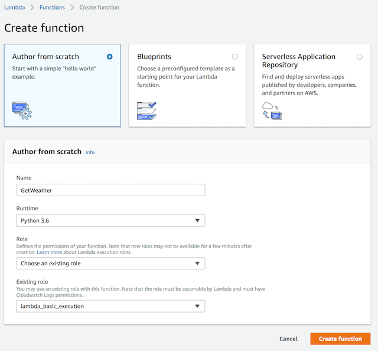
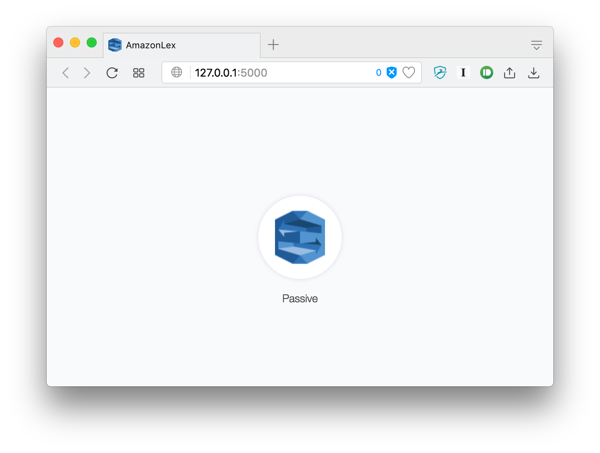

AWS Lex Demo
============

Amazon Lex is a service for building conversational user interfaces (like chatbots) into everyday applications. In the past, developing tools like Lex have been incredibly complex, especially when one considers the power of Lex, allowing for the transcription, processing, and synthesis of text all via a few API calls. This project is a simple demo of Lex and how it can be used to process voice input and act on a users input (refereed to as utterances).

## Setup
In order to use Amazon Lex, and AWS Lambda (the compute unit that will be used by our bot), you must have an active AWS account (with billing information entered). You will need to create an IAM user with programmatic access, and access to both Lex and Lambda via the AWSLambdaFullAccess. and AmazonLexFullAccess.

You will need to save the IAM Access Credentials (both the Access Key and the Secret Access Key) in `Config.py`. We will also need to create a AWS Lambda Function to respond to the user once all of the necessary information has been obtained. To do this, we will use the AWS Console to create a new "Python 3.6" function based off of the code in `lambda_function.py`. We will need to modify the code in the Lambda Function slightly, as we will utilize the [Weather Underground API](https://www.wunderground.com/weather/api) in order to get the weather. Setup your account, the free developer tier will suffice for our test application. Save your Wunderground API Key at the top of the `lambda_function.py` where the corresponding variable is named `WUNDERGROUND_API_KEY`. You can now copy/paste this code into your lambda function.



Once you have created your Lambda function, make note of the ARN in the top right corner and save it in the `Config.py` file. We are now ready to have the setup script create our first bot, and the main intent. Install the necessary dependencies and execute the script via the command:

```sh
pip install -r requirements.txt
python3 setup_aws.py
```

## Usage
Our setup script created a bot named "WeatherDemo", which should be listed in the AWS console as such. We can test our bot there via the text chat window, and we can see that everything is working the way it should. However, Lex is capable of more than just Text Chat, and we can make use of its speech-to-text and its text-to-speech capabilities via a sample web app (originally created by the AWS team) to try out our bot. The web server is started by executing the following command:

```sh
python3 app.py
```

Once the server is started, we can visit http://127.0.0.1:5000 in our browser to access the demo.



Clicking on the Amazon Lex logo in the middle will start the audio recording (you may have to allow your bowser to use your microphone), and once a pause is detected by the browser, the text is sent to Lex for transcription, processing, and synthesis. Once complete, the browser will play back the spoken audio of the response from the Lambda function.

## Background
### Data Flow
Amazon Lex is a complex service that takes a set of technically difficult tasks and makes them super accessible to the user. Initially, the voice data (if an audio recording is being sent) is processed by Amazon Transcribe, which produces a text result from the provided speech. This process is referred to as Speech to Text. This text is then processed by Lex via its Intent Model (discussed in the following section) in order to determine what the user wants and what the system needs to know in order to get the user the information they want. The result from lex is then converted back into speech via a Text to Speech engine, like that offered by Amazon Polly. Polly makes use of advanced deep learning technologies to synthesize speech that sounds like a human voice, and the results are really good.

### Intent Model (Slots & Utterances)
An intent is essentially a goal of a user, like to reserve a hotel room, order a pizza, or in our case find out about the weather. Every intent includes a set of "Sample Utterances" which are ways we can expect the user to ask a question. While these sample utterances do not need to match up 100% with what the user will say, they need to be fairly accurate, since Lex does not have any knowledge about the English language per say. In our case, we trained our Intent with 8 different sample utterances, found in the `sample_utterances.txt` file. These sample utterances make use of slots to mark the data we need to extract from the utterance. A slot is like a variable that the user will define, in our case it is the city they are inquiring about, but in other cases, like the pizza ordering example, the slots might include the type of crust, the toppings, etc. Every slot has a type associated with it. This is done to not only validate the input, but make the speech-to-text recognition more accurate (if it is being used). In our case, we are using the built-in "AMAZON.US_CITY" slot type to match the city the user is asking about. Since we marked the field as required when we setup the intent, Lex is smart enough to ask the user on its own if a sample utterance is used that does not include all of of the required slots.

### Acting on Intents
Once all of the slots have been filled, Lex sends the request over to Lambda to "act" on the request of the user. In our case this request is to get the weather, but it might be much more complex and involve outside systems, like hotel reservation APIs. Lambda allows us to execute a piece of pre-defined Python code with the necessary arguments from Lex whenever we need to, making it super simple, cheap, and scalable. Since we used Lex and Lambda, the only scaling issue we would have would be our WeatherUnderground API key, but beyond that, our demo service would scale automatically to serve hundreds of thousands of users without any issues.

## Attribution
The Web demo of Amazon Lex was adapted from the sample code found on the AWS Blog, and was developed by Andrew Lafranchise. [Capturing Voice Input in a Browser and Sending it to Amazon Lex](https://aws.amazon.com/blogs/machine-learning/capturing-voice-input-in-a-browser/)
